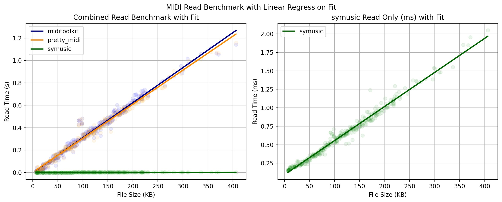
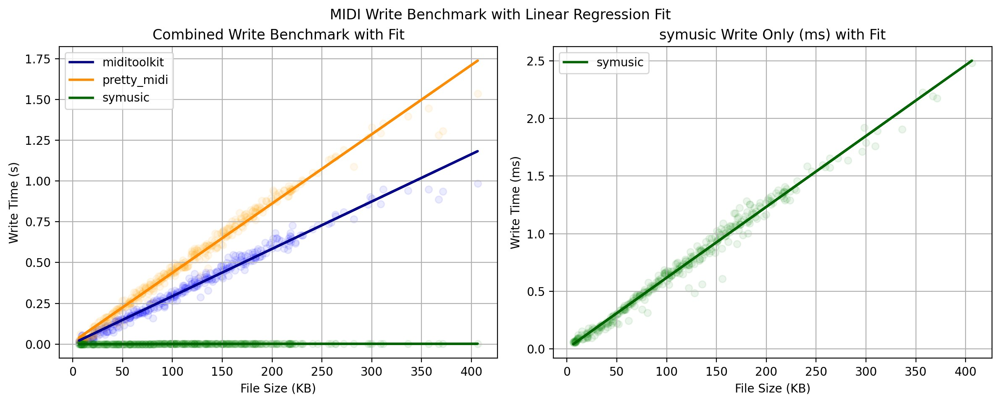

# [symusic](https://github.com/Yikai-Liao/symusic)
[](https://github.com/Yikai-Liao/symusic/actions/workflows/wheel.yml) [](https://badge.fury.io/py/symusic) [](https://pepy.tech/project/symusic) [](https://badges.toozhao.com/stats/01HGE1345YAKN4YV7WF0JRKZJK "Get your own page views count badge on badges.toozhao.com") <a target="_blank" href="https://colab.research.google.com/github/Yikai-Liao/symusic/blob/main/tutorial.ipynb">
  
</a>

**🎉ISMIR 2024 LBD Demo Vedio**: [Youtube](https://www.youtube.com/watch?v=ZGcyyUJ3P6Q) [Bilibili](https://www.bilibili.com/video/BV1mJUaYcEj1)

**Sy**music("**Sy**bolic **Music**") is a cross-platform `note level` midi decoding library with lightening speed, which is hundreds of times faster (100x to 1000x depending on your file size) than [mido](https://github.com/mido/mido), the main midi parsing library in python.

The library is written in cpp and based on [minimidi](https://github.com/lzqlzzq/minimidi/tree/main). It offers a python binding using pybind11.

Here, we have added a tutorial.ipynb for you to learn about how to use the library. <a target="_blank" href="https://colab.research.google.com/github/Yikai-Liao/symusic/blob/main/tutorial.ipynb">
  
</a>

And a [document](https://yikai-liao.github.io/symusic/) is also available. Not complete though.

## Features

* You can just read a midi file like `score = symusic.Score("path to midi", ttype="tick")`
* Writing back to midi is now supported! `score.dump_midi("path")`
* Multiple `time unit (ttype)` is now supported (currently `tick` and `quarter`)
* The tempo attribute in the tempo event represents quarter per minute (qpm)
* We offer some batch operation functions for both `Score` and `Track` class:
  * shift_pitch(offset: int)
  * shift_velocity(offset: int)
  * shift_time(offset: float)
  * sort(key, reverse)
* You can operate each note just like you did before in python (like PrettyMidi)
* Extremely fast `pickle` is now supported
* `.numpy()` method for getting [SoA](https://en.wikipedia.org/wiki/AoS_and_SoA) data
* `.filter(func, inplace)` method for filtering objets in all the "List" in symusic
* A new synthesizer is now available! It comes from our another project [prestosynth](https://github.com/lzqlzzq/prestosynth).
  Find usages in our document. Note that we will support more features of soundfont for synthesizing in the future.

## Installation
### Use pre-compiled version
```bash
pip install symusic
```

### Build from source
> Make sure that your system has cmake and c++ compilers
>
You could clone from github and install it by pip
```bash
git clone --recursive https://github.com/Yikai-Liao/symusic
pip install ./symusic
```

Or you could install the source distribution from pypi
```bash
pip install symusic --no-binary symusic
```

For debugging purpose, you could pass `-Ccmake.define.MEM_LEAK_WARNING=True` to `pip install` to enable the memory leak warning from `nanobind`.
```bash
pip install -Ccmake.define.MEM_LEAK_WARNING=True ./symusic
```

## Benchmark

* `midifile` is writen in cpp, and could parse midi files to both `event level` and `note level`. It is slow mostly because of `iostream`.
* `mido` is writen in pure python, and only parses midi files to `event level`
* `pretty_midi` and `miditoolkit` is based on `mido`, and parse midi files to `note level`
* For libraries written in python or with python bindings, we use `timeit` to measure the time cost of parsing the midi file. `nanobench` for cpp libraries and `BenchmarkTools` for julia libraries.
* The following `Common MIDI File` benchmarks could be found in [symusic-benchmark](https://github.com/Yikai-Liao/symusic-benchmark). And they are tested on (AMD Ryzen 7 8845H, 32GB 7500 MT/s, Linux 6.11.7)


### Common MIDI File Parsing



### Common MIDI File Dumping



### Large MIDI File Parsing
* test using [mahler.mid](https://github.com/lzqlzzq/minimidi/blob/main/example/mahler.mid) from minimidi/example on my laptop (i7-10875H, 32GB 2666MHz DDR4 RAM, Linux 6.1.69-1-lts)
* Note that mahler.mid is quite a large midi file. So this benchmark mainly reelects the `parsing time` (the percentage of time of loading file gets more significant when file is smaller)

| library                                                       | level | absolute time     | relative time |
|---------------------------------------------------------------|-------|-------------------|---------------|
| [**minimidi**](https://github.com/lzqlzzq/minimidi)           | event | 2.86 ms           | 1.0x          |
| [**symusic**](https://github.com/Yikai-Liao/symusic)          | note  | 3.47 ms ± 113 µs  | 1.2x          |
| [midifile](https://github.com/craigsapp/midifile)             | event | 44.0 ms           | 15.4x         |
| [midifile](https://github.com/craigsapp/midifile)             | note  | 45.6 ms           | 15.9x         |
| [MIDI.jl](https://github.com/JuliaMusic/MIDI.jl)              | note  | 109.707 ms        | 38.4x         |
| [mido](https://github.com/mido/mido)                          | event | 2.92 s ± 42.7 ms  | 1021.0x       |
| [miditoolkit](https://github.com/YatingMusic/miditoolkit)     | note  | 3.15 s ± 38.2 ms  | 1101.4x       |
| [pretty_midi](https://github.com/craffel/pretty-midi)         | note  | 3.16 s ± 9.56 ms  | 1104.9x       |
| [music21](https://github.com/cuthbertLab/music21)             | note  | 4.23 s ± 34.5 ms  | 1479.0x       |

## Citation

```bibtex
@inproceedings{symusic2024,
    title={symusic: A swift and unified toolkit for symbolic music processing},
    author={Yikai Liao, Zhongqi Luo, et al.},
    booktitle={Extended Abstracts for the Late-Breaking Demo Session of the 25th International Society for Music Information Retrieval Conference},
    year={2024},
    url={https://ismir2024program.ismir.net/lbd_426.html#lbd},
}
```

## Acknowledgement

* [minimidi](https://github.com/lzqlzzq/minimidi) : A fast and lightweight midi parsing library written in cpp, which is the foundation of this project.
* [prestosynth](https://github.com/lzqlzzq/prestosynth) : A new fast soundfont synthesizer written in cpp, which is the foundation of the synthesizer in this project.
* [nanobind](https://github.com/wjakob/nanobind) : A efficient and lightweight library for binding C++ to Python, which is significantly faster than [pybind11](https://github.com/pybind/pybind11).
* [zpp_bits](https://github.com/eyalz800/zpp_bits) : An extraordinary fast and lightweight single header library for serialization and deserialization. I use it to support pickle.
* [geek_time_cpp](https://github.com/adah1972/geek_time_cpp/tree/master) The example code of the book "Modern C++ Programming Practice". We use the [metamacro.h](https://github.com/adah1972/geek_time_cpp/blob/master/40/metamacro.h#L1-L622) in it for shortening the code.
* [utfcpp](https://github.com/nemtrif/utfcpp) An easy to use and portable library for handling utf8 string in C++.
